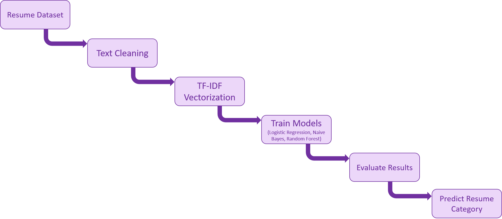
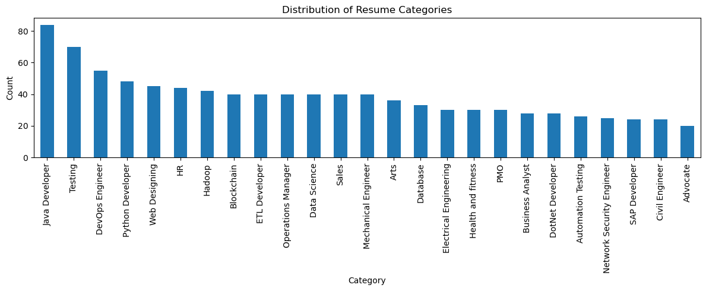
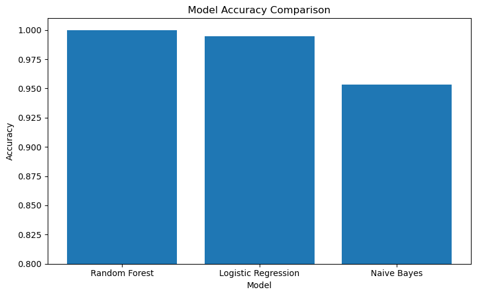
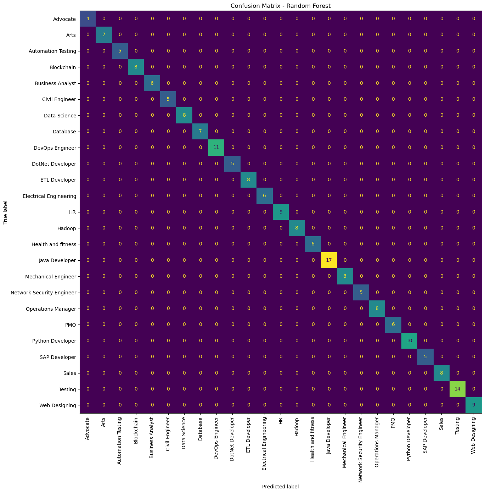

# Resume Screening AI

Machine Learning + NLP project for automatic resume classification using Python.

## Overview

This project explores how Machine Learning and Natural Language Processing (NLP) can be used to improve resume screening by automatically classifying resumes into job categories based on their text content.

Traditional Applicant Tracking Systems (ATS) mainly depend on direct keyword matching, which can miss resumes that use different wording or phrasing. In contrast, this project uses TF-IDF and machine learning models to learn patterns and relationships between words across resumes, allowing the system to make more intelligent classifications based on overall context rather than exact keyword presence alone.

The system processes raw resume text, converts it into numerical features, trains multiple machine learning models, and compares their performance using accuracy metrics and confusion matrix analysis.

## Features

- Resume text preprocessing
- TF-IDF feature extraction
- Logistic Regression
- Naive Bayes
- Random Forest
- Confusion matrix analysis
- Resume category prediction

## Dataset

Kaggle Resume Dataset:

https://www.kaggle.com/datasets/gauravduttakiit/resume-dataset

## Technologies Used

- Python
- pandas
- numpy
- scikit-learn
- matplotlib
- Jupyter Notebook

## Results

| Model | Accuracy |
|------|------|
| Logistic Regression | 99.48% |
| Naive Bayes | 95.34% |
| Random Forest | 100% |

## Project Flow

## Resume Category Distribution

## Accuracy Comparison

## Confusion Matrix

## Future Improvements

- Larger datasets
- Deep learning models
- Better semantic understanding
- Real-time web interface
- Integration with recruitment systems

## Author

Jael David
